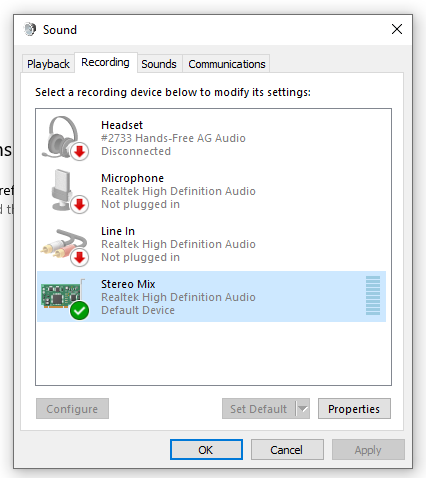
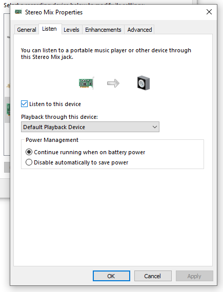
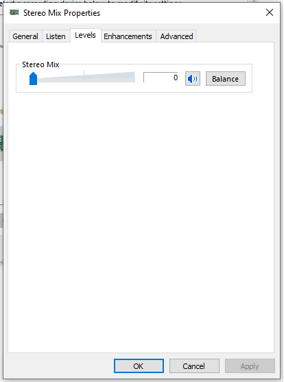

# basic screen recorder with audio for Windows    
    
This is a screen recording app for Windows. It uses code from my [gif-capturing app](https://github.com/syncopika/gifCatch_desktop-Windows-) and some [WASAPI sample code](https://github.com/microsoft/Windows-classic-samples/tree/main/Samples/Win7Samples/multimedia/audio/CaptureSharedTimerDriven) that Microsoft has kindly provided.    
    
It does screen capturing and audio recording based on the duration to capture and the time interval between frames set by the user and spits out an .mp4 video file (along with a folder of captured frames and a wav file of the captured audio).    
    
Features include:    
- various image filters
- ability to add a caption
- ability to capture the mouse cursor
- can specify whether to capture audio only, the screen only, or both
    
**Note**: this project relies on `ffmpeg` to create the video file and expects it to be installed. Other than that, no other external dependencies! I used Visual Studio 2019 Community and Windows 10 to build this project.    
    
    
    
    
## current limitations:    
- capture duration is capped at 30 seconds currently
- `ffmpeg` is expected to be on PATH
    
If no audio file is playing, no audio will be captured, which is expected behavior with WASAPI loopback but can result in truncated audio (which will not be aligned with the frames captured)
if there's initial silence or a file gets stopped/replayed throughout after starting recording. You can see this behavior in Audacity with WASAPI as the audio host.    
    
One workaround is to go to Control Panel -> Hardware and Sound -> Manage audio devices -> 
then right-click on an enabled recording device (e.g. Stereo Mix) -> Properties -> click on Listen tab -> click 'Listen to this device' checkbox -> click on Levels tab and set volume to 0 (see screenshots below).    
    
This should allow the audio to be recorded continuously even if there's technically no audio file being played.    
    
    
    
    
    

example output from the app 

<video src="https://user-images.githubusercontent.com/8601582/230380457-52cd23d8-d937-4ea8-98a2-3b88c7042be9.mp4"></video> 
from the anime _Bocchi the Rock!_ (ep 4) with saturation filter applied.
    

<video src="https://user-images.githubusercontent.com/8601582/230383000-f060cddf-9d3d-47dd-b0a2-326a598fc495.mp4"></video>
from https://www.youtube.com/watch?v=D8gwnKApqCE

