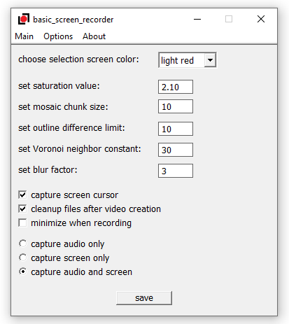

# basic screen recorder with audio for Windows    
    
This is a screen recording app for Windows. It uses code from my [gif-capturing app](https://github.com/syncopika/gifCatch_desktop-Windows-) and some [WASAPI sample code](https://github.com/microsoft/Windows-classic-samples/tree/main/Samples/Win7Samples/multimedia/audio/CaptureSharedTimerDriven) that Microsoft has kindly provided.    
    
It does screen capturing and audio recording based on the duration to capture and the time interval between frames set by the user and spits out an .mp4 video file (along with a folder of captured frames and a wav file of the captured audio). Features include: various image filters, ability to add a caption and the ability to capture the mouse cursor.    
    
**Note**: this project relies on `ffmpeg` to create the video file and expects it to be installed. Other than that, no other external dependencies! I used Visual Studio 2019 Community and Windows 10 to build this project.    
    
    
    
    
## current limitations:    
- capture duration is capped at 30 seconds currently
- `ffmpeg` is expected to be on PATH