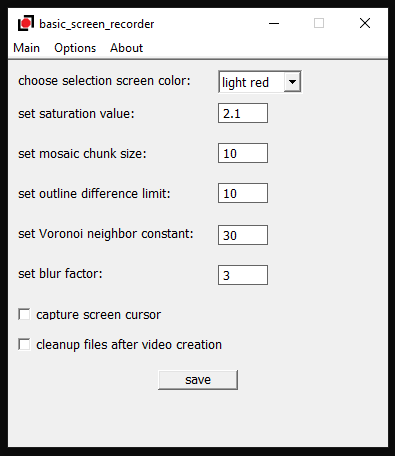

# basic screen recorder for Windows    
    
This is supposed to be a screen recording app for Windows. It uses code from my [gif-capturing app](https://github.com/syncopika/gifCatch_desktop-Windows-) and some [WASAPI sample code](https://github.com/microsoft/Windows-classic-samples/tree/main/Samples/Win7Samples/multimedia/audio/CaptureSharedTimerDriven) that Microsoft has kindly provided.    
    
It does screen capturing and audio recording based on the duration to capture set by the user and spits out an .mp4 video file. Right now it seems to work ok but please don't expect too much (still a work-in-progress as there's a lot to fix) :).    
    
This project relies on `ffmpeg` to create the video file and expects it to be installed. Other than that, no other external dependencies! I used Visual Studio 2019 Community and Windows 10 to build this project.    
    
    
    